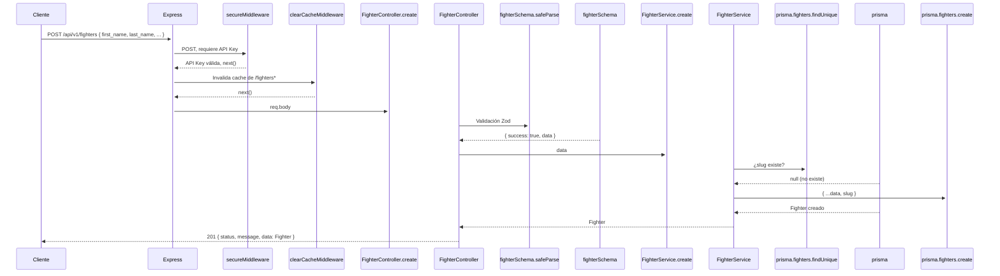

# VeloMMA API — Documentación Técnica

> **Versión:** 1.0.0  
> **Propósito:** API analítica con estadísticas avanzadas de eventos, peleadores y métricas de la UFC.  
> **Arquitectura:** Backend monolítico con capas (Routes → Controllers → Services → Prisma ORM → PostgreSQL).

---

## Visión General

VeloMMA es una plataforma de datos diseñada para modelar y consultar información del mundo de las Artes Marciales Mixtas (MMA). Proporciona una API RESTful que permite gestionar luchadores, equipos, divisiones de peso, eventos, peleas, métricas por asalto, jueces, pesajes, bonificaciones, odds de apuestas, rankings, títulos, campamentos de entrenamiento, lesiones y estadísticas de carrera.

**Principios arquitectónicos:**

- **Modular monolítico** — cada dominio de negocio es un módulo autocontenido con ruta, controlador, servicio y esquema de validación.
- **ORM-first** — toda la persistencia se maneja mediante Prisma ORM sobre PostgreSQL.
- **Seguridad por API Key** — las operaciones de escritura (`POST`, `PATCH`, `DELETE`) requieren el header `x-api-key`; las lecturas (`GET`) son públicas.
- **Cache opcional con Redis** — respuestas `GET` exitosas se cachean 120 segundos si Redis está habilitado.
- **Documentación OpenAPI** integrada con Swagger UI en `/api/v1/docs`.
- **Soft-delete generalizado** — ninguna operación destruye datos; se marcan con `deleted_at`.

---

## Pila Tecnológica y Librerías

| Librería | Versión | Rol en el proyecto |
|---|---|---|
| **Node.js** | ^22.15 | Runtime del servidor |
| **Express** | ^5.2.1 | Framework HTTP con routing, middlewares y manejo de peticiones |
| **TypeScript** | ^6.0.3 | Tipado estático en tiempo de desarrollo y compilación |
| **Prisma** | ^7.8.0 | ORM: modelado, migraciones y generación del cliente de base de datos |
| **@prisma/adapter-pg** | ^7.8.0 | Adaptador nativo PostgreSQL para Prisma |
| **pg** | ^8.22.0 | Driver PostgreSQL nativo |
| **Zod** | ^4.4.3 | Validación y tipado de esquemas de entrada (_payload validation_) |
| **Redis** | ^6.0.1 | Caché distribuida para respuestas GET |
| **Helmet** | ^8.2.0 | Seguridad HTTP (headers, CSP, XSS, etc.) |
| **CORS** | ^2.8.6 | Control de acceso跨域 para el frontend (futuro) |
| **express-rate-limit** | ^8.5.1 | Rate limiting: 100 peticiones por minuto |
| **cookie-parser** | ^1.4.7 | Parseo de cookies HTTP |
| **Morgan** | ^1.11.0 | Logging de peticiones HTTP en consola |
| **swagger-jsdoc** | ^6.3.0 | Generación de especificación OpenAPI desde comentarios JSDoc |
| **swagger-ui-express** | ^5.0.1 | Servir la interfaz Swagger UI |
| **tsx** | ^4.22.4 | Ejecución en caliente de TypeScript en desarrollo |
| **dotenv** | ^17.4.2 | Carga de variables de entorno desde `.env` |
| **Jest** | ^30.4.2 | Framework de testing unitario y de integración |
| **Supertest** | ^7.2.2 | Pruebas HTTP sobre Express |
| **SWC** | ^1.15.43 | Compilador rápido para Jest |
| **Prisma CLI** | ^7.8.0 | Migraciones, generación de cliente y validación del schema |
| **Rimraf** | ^6.1.3 | Limpieza de directorio `dist` en prebuild |
| **cross-env** | ^10.1.0 | Variables de entorno multiplataforma en scripts |

---

## Estructura de Directorios

```
backend/
├── app.ts                          # Punto de entrada: configura Express, middlewares, rutas
├── package.json                    # Dependencias y scripts
├── tsconfig.json                   # Configuración de TypeScript (NodeNext, strict)
├── prisma.config.ts                # Configuración adicional de Prisma
├── Dockerfile                      # Build de la imagen Docker (Node 22 Alpine + PNPM)
├── jest.config.ts                  # Configuración de Jest (SWC transform)
├── jest.setup.ts                   # Setup global de tests (mock de Redis)
│
├── .env                            # Variables de entorno locales
├── .env.example                    # Plantilla de variables de entorno
├── .env.test                       # Variables para el entorno de test
│
├── config/
│   ├── settings.ts                 # Carga y normalización de variables de entorno
│   ├── cache/
│   │   └── redis.ts                # Cliente Redis (singleton lazy)
│   └── swagger/
│       └── docs.ts                 # Especificación OpenAPI 3.0.0
│
├── prisma/
│   ├── schema.prisma               # Modelo de datos (17 tablas, 13 enums)
│   └── migrations/                 # Migraciones SQL versionadas (7 migraciones)
│       ├── 20260622201503_add_tables_for_velo/
│       ├── 20260623160200_add_field_in_tables_many_of_many/
│       ├── 20260623161017_change_relational_structure/
│       ├── 20260628164853_add_field_in_table_bout/
│       ├── 20260628173639_add_tables_ranking_and_bonuses/
│       └── 20260702152528_add_new_tables_camps_stats_odds_and_titles/
│
├── generated/prisma/               # Cliente Prisma generado automáticamente
│
├── src/
│   ├── api/
│   │   └── routes.ts               # Montaje global de todos los módulos con secureMiddleware
│   │
│   ├── common/
│   │   ├── decorator/
│   │   │   └── decorator.ts        # @SendResponse: normaliza respuestas JSON/error
│   │   └── errors/
│   │       └── error.ts            # Jerarquía de excepciones HTTP (7 clases)
│   │
│   ├── middlewares/
│   │   ├── cache/
│   │   │   ├── global-cache.middleware.ts   # Cache GET responses en Redis (TTL 120s)
│   │   │   └── clear-cache.middleware.ts    # Invalida cache por patrón tras escritura
│   │   ├── Exception/
│   │   │   └── errors.middleware.ts         # Captura HttpException y retorna JSON
│   │   └── routes/
│   │       └── route.middlewares.ts         # secureMiddleware: API Key en escritura
│   │
│   ├── modules/                    # ★ Núcleo del dominio: 16 sub-módulos
│   │   ├── fighters/               # CRUD de luchadores
│   │   ├── teams/                  # CRUD de equipos/gimnasios
│   │   ├── divisions/              # CRUD de divisiones de peso
│   │   ├── events/                 # CRUD de eventos
│   │   ├── relational/             # Módulos relacionales (N:M y agregaciones)
│   │   │   ├── injuries/           # Lesiones de luchadores
│   │   │   ├── stables/            # Asignación luchador → equipo
│   │   │   ├── weights/            # Asignación luchador → división
│   │   │   ├── ranking/            # Rankings por división
│   │   │   ├── titles/             # Historial de títulos/cinturones
│   │   │   ├── camps/              # Campamentos de entrenamiento
│   │   │   └── stats/              # Estadísticas de carrera (cálculo agregado)
│   │   └── bouts/                  # Módulos de peleas (sub-módulos)
│   │       ├── index.ts            # Barredora de exportaciones
│   │       ├── bout/               # CRUD de peleas
│   │       ├── judges/             # Puntajes de jueces
│   │       ├── metrics/            # Métricas round-by-round
│   │       ├── weighIns/           # Pesajes oficiales
│   │       ├── bonus/              # Bonos post-pelea
│   │       └── odds/               # Odds de apuestas por proveedor
│   │
│   ├── types/                      # Interfaces TypeScript por dominio
│   │   ├── api/api.ts              # APIResponse<T> genérico
│   │   ├── fighters/               # FighterDTO, FighterUpdateDTO
│   │   ├── teams/                  # TeamDTO, TeamUpdateDTO
│   │   ├── divisions/              # DivisionDTO, DivisionUpdateDTO
│   │   ├── events/                 # EventDTO, EventUpdateDTO
│   │   ├── bouts/                  # BoutDTO, JudgeDTO, MetricDTO, etc.
│   │   └── relational/             # WeightDTO, TitleDTO, CampDTO, etc.
│   │
│   └── utils/
│       ├── utils.ts                # routesConfig (array de {path, router}) + tablesToClear
│       ├── functions/function.ts   # Utilidad registerRoutes + BoutStatusRecord
│       └── prisma/prisma.ts        # Instancia singleton de PrismaClient con adapter pg
│
├── __test__/                       # Tests automatizados (Jest + Supertest)
│   ├── api/api.test.ts             # Smoke tests de rutas base
│   ├── fighters/fighter.test.ts    # CRUD de luchadores
│   └── helpers/testBase.ts         # Clase base con limpieza de BD
│
└── test/                           # Archivos .http para pruebas manuales (REST Client)
    ├── api.http
    ├── fighters.http
    ├── event.http
    ├── division.http
    ├── team.http
    ├── bouts/
    │   ├── bout/bout.http
    │   ├── odds/odds.http
    │   ├── metrics/metric.http
    │   ├── judges/judge.http
    │   ├── weighIns/weighIns.http
    │   └── bonus/bonus.http
    └── relational/
        ├── weights/weight.http
        ├── titles/titles.http
        ├── stats/stats.http
        ├── stables/stable.http
        ├── ranking/rank.http
        ├── injuries/injuries.http
        └── camps/camp.http
```

---

## Modelo de Datos (Prisma Schema)

### Enumeraciones

| Enum | Valores |
|---|---|
| `Gender` | `Masculino`, `Femenino`, `Otro` |
| `Stance` | `Orthodox`, `Southpaw`, `Switch`, `Open_Stance` |
| `BoutResult` | `Win_Red`, `Win_Blue`, `Draw`, `No_Contest` |
| `WinMethod` | `KO`, `TKO`, `Submission`, `Unanimous_Decision`, `Split_Decision`, `Majority_Decision`, `Doctor_Stoppage`, `Disqualification` |
| `BonusType` | `Fight_of_the_night`, `Performance_of_the_night`, `Submission_of_the_night`, `Knockout_of_the_night` |
| `InjurySeverity` | `Menor`, `Moderado`, `Severo` |
| `BoutStatus` | `Programada`, `Cancelada`, `En_Proceso`, `Finalizada` |
| `TitleType` | `Undisputed`, `Interino`, `Vacante` |
| `SubmissionType` | `Rear_Naked_Choke`, `Guillotine_Choke`, `Armbar`, `Triangle_Choke`, `Kimura`, `Americana`, `Ankle_Lock`, `Heel_Hook`, `Kneebar`, `Wrist_Lock`, `Other` |

### Tablas (17)

| Tabla (física) | Modelo Prisma | Descripción |
|---|---|---|
| `fighters` | `fighters` | Luchadores: datos personales, slug único, estancia, activo |
| `fighter_injuries` | `fighterInjuries` | Lesiones: descripción, severidad, fechas |
| `divisions` | `divisions` | Divisiones de peso: nombre, clase, género |
| `fighter_division` | `fighterDivision` | **N:M** — luchador ↔ división (unique compuesto) |
| `teams` | `teams` | Equipos/gimnasios: nombre, ubicación, fundación |
| `fighter_teams` | `fighterTeams` | **N:M** — luchador ↔ equipo con fechas join/leave |
| `events` | `events` | Eventos: nombre, fecha, ubicación, recinto, tamaño octágono |
| `bouts` | `bouts` | Peleas: esquina roja/azul, resultado, método, réferi, título |
| `bout_metrics` | `boutMetrics` | Métricas por asalto: golpes, derribos, control (unique bout+fighter+round) |
| `bout_judges` | `boutJudges` | Puntajes de jueces (unique bout+judge_name) |
| `bout_weigh_ins` | `boutWeighIns` | Pesajes oficiales (unique bout+fighter) |
| `fighter_rankings` | `fighterRankings` | Rankings por división con fecha |
| `bout_bonuses` | `boutBonuses` | Bonos post-pelea por luchador |
| `fighter_titles` | `fighterTitles` | Historial de títulos/cinturones |
| `bout_odds` | `boutOdds` | Odds de apuestas (apertura/cierre) por proveedor |
| `training_camps` | `trainingCamps` | Campamentos: luchador + equipo para una pelea (unique bout+fighter) |
| `fighter_stats` | `fighterStats` | Estadísticas de carrera (1 registro por luchador, upsert) |

### Diagrama de Relaciones Clave

```
events 1──N bouts 1──N boutMetrics
                 1──N boutJudges
                 1──N boutWeighIns
                 1──N boutBonuses
                 1──N boutOdds
                 1──N trainingCamps
                 N──1 fighters (red_corner)
                 N──1 fighters (blue_corner)
                 N──1 divisions

fighters 1──N fighterInjuries
         1──N fighterDivision N──1 divisions
         1──N fighterTeams    N──1 teams
         1──N trainingCamps
         1──1 fighterStats

divisions 1──N fighterRankings
          1──N fighterTitles
```

---

## Variables de Entorno

| Variable | Default | Descripción |
|---|---|---|
| `PORT` | `3000` | Puerto del servidor Express |
| `NODE_ENV` | `development` | Entorno (`development`, `test`, `production`) |
| `BASE_PATH` | `""` | Prefijo base de rutas (ej. `/api/v1`) |
| `DATABASE_URL` | — | Cadena de conexión PostgreSQL |
| `API_SECRET_KEY` | — | API Key para autenticar escrituras |
| `JWT_SECRET` | `"secret"` | Reservado para futura autenticación JWT |
| `COOKIE_SECRET` | — | Secreto para firmar cookies |
| `CORS_ORIGIN` | `"*"` | Origen permitido para CORS |
| `REDIS_URL` | — | URL de conexión Redis |
| `REDIS_PORT` | `6379` | Puerto Redis |
| `REDIS_ENV` | `false` | Habilita/deshabilita el caché Redis |

---

## Rutas y Endpoints

> **Base URL:** `http://localhost:{PORT}{BASE_PATH}` (ej. `http://localhost:3000/api/v1`)  
> **Autenticación:** `GET` → pública | `POST/PATCH/DELETE` → requiere header `x-api-key`.  
> **Cache:** las rutas POST/PATCH/DELETE incluyen `clearCacheMiddleware` para invalidar cache del patrón.  
> **Respuesta estándar:**

```json
{
  "status": 200,
  "message": "Operación exitosa",
  "data": { ... },
  "meta": { "total": 10, "page": 1, "limit": 10 }  // solo en listas paginadas
}
```

### Rutas Base (montadas directamente en app.ts)

| Método | Ruta | Descripción |
|---|---|---|
| `GET` | `{basePath}/` | Bienvenida: mensaje + timestamp |
| `GET` | `{basePath}/health` | Health check: uptime, memoria, versión Node |
| `GET` | `{basePath}/ping` | Ping: `{ status: "pong" }` |
| `GET` | `{basePath}/docs` | Swagger UI |

### Luchadores — `/fighters`

| Método | Ruta | Parámetros | Respuesta |
|---|---|---|---|
| `POST` | `/` | Body: `CreateFighterInput` | `201` → Fighter creado |
| `GET` | `/` | Query: `?page=1&limit=10` | `200` → Fighter[] + paginación |
| `GET` | `/active` | Query: `?page=1&limit=10` | `200` → Fighter[] activos |
| `GET` | `/:fighterId` | Path: `fighterId` (int) | `200` → Fighter |
| `GET` | `/slug/:slug` | Path: `slug` (string) | `200` → Fighter |
| `PATCH` | `/:fighterId` | Path: `fighterId`, Body: `UpdateFighterInput` | `200` → Fighter actualizado |
| `PATCH` | `/:fighterId/status` | Path: `fighterId`, Body: `{ is_active: boolean }` | `200` → Fighter |
| `PATCH` | `/soft/:fighterId` | Path: `fighterId` | `200` → Fighter (soft delete) |

### Equipos — `/teams`

| Método | Ruta | Parámetros | Respuesta |
|---|---|---|---|
| `POST` | `/` | Body: `CreateTeamInput` | `201` → Team |
| `GET` | `/` | — | `200` → Team[] |
| `GET` | `/active` | — | `200` → Team[] activos |
| `GET` | `/:teamId` | Path: `teamId` (int) | `200` → Team |
| `PATCH` | `/:teamId` | Path: `teamId`, Body: `UpdateTeamInput` | `200` → Team |
| `PATCH` | `/:teamId/status` | Path: `teamId`, Body: `{ is_active }` | `200` → Team |
| `PATCH` | `/soft/:teamId` | Path: `teamId` | `200` → Team (soft delete) |

### Divisiones — `/divisions`

| Método | Ruta | Parámetros | Respuesta |
|---|---|---|---|
| `POST` | `/` | Body: `CreateDivisionInput` | `201` → Division |
| `GET` | `/` | — | `200` → Division[] |
| `GET` | `/active` | — | `200` → Division[] activas |
| `GET` | `/:divisionId` | Path: `divisionId` (int) | `200` → Division |
| `PATCH` | `/:divisionId` | Path: `divisionId`, Body: `UpdateDivisionInput` | `200` → Division |
| `PATCH` | `/:divisionId/status` | Path: `divisionId`, Body: `{ is_active }` | `200` → Division |
| `PATCH` | `/soft/:divisionId` | Path: `divisionId` | `200` → Division (soft delete) |

### Eventos — `/events`

| Método | Ruta | Parámetros | Respuesta |
|---|---|---|---|
| `POST` | `/` | Body: `CreateEventInput` | `201` → Event |
| `GET` | `/` | — | `200` → Event[] |
| `GET` | `/active` | — | `200` → Event[] activos |
| `GET` | `/location/:location` | Path: `location` (string) | `200` → Event[] filtrados |
| `GET` | `/:eventId` | Path: `eventId` (int) | `200` → Event |
| `PATCH` | `/:eventId` | Path: `eventId`, Body: `UpdateEventInput` | `200` → Event |
| `PATCH` | `/:eventId/status` | Path: `eventId`, Body: `{ is_active }` | `200` → Event |
| `PATCH` | `/soft/:eventId` | Path: `eventId` | `200` → Event (soft delete) |

### Lesiones — `/injuries`

| Método | Ruta | Parámetros | Respuesta |
|---|---|---|---|
| `POST` | `/` | Body: `CreateInjuryInput` | `201` → Injury |
| `GET` | `/fighter/:fighterId` | Path: `fighterId` | `200` → Injury[] |
| `GET` | `/:injuryId` | Path: `injuryId` | `200` → Injury |
| `GET` | `/:fighterId/severity` | Path: `fighterId` | `200` → Injury[] |
| `PATCH` | `/:injuryId` | Path: `injuryId`, Body: `UpdateInjuryInput` | `200` → Injury |
| `PATCH` | `/:injuryId/status` | Body: `{ is_active }` | `200` → Injury |
| `PATCH` | `/soft/:injuryId` | Path: `injuryId` | `200` → Injury (soft delete) |

### Stables (Fighter-Teams) — `/stables`

| Método | Ruta | Parámetros | Respuesta |
|---|---|---|---|
| `POST` | `/` | Body: `CreateStableInput` | `201` → FighterTeam |
| `GET` | `/fighter/:fighterId` | Path: `fighterId` | `200` → FighterTeam[] |
| `GET` | `/:stableId` | Path: `stableId` | `200` → FighterTeam |
| `PATCH` | `/:stableId` | Body: `UpdateStableInput` | `200` → FighterTeam |
| `PATCH` | `/soft/:stableId` | — | `200` → FighterTeam (soft delete) |

### Weights (Fighter-Division) — `/weights`

| Método | Ruta | Parámetros | Respuesta |
|---|---|---|---|
| `POST` | `/` | Body: `CreateWeightInput` | `201` → FighterDivision |
| `GET` | `/fighter/:fighterId` | Path: `fighterId` | `200` → FighterDivision[] |
| `GET` | `/:weightId` | Path: `weightId` | `200` → FighterDivision |
| `PATCH` | `/:weightId` | Body: `UpdateWeightInput` | `200` → FighterDivision |
| `PATCH` | `/soft/:weightId` | — | `200` → FighterDivision (soft delete) |

### Rankings — `/rankings`

| Método | Ruta | Parámetros | Respuesta |
|---|---|---|---|
| `POST` | `/` | Body: `CreateRankingInput` | `201` → Ranking |
| `GET` | `/` | — | `200` → Ranking[] |
| `GET` | `/division/:divisionId` | Path: `divisionId` | `200` → Ranking[] |
| `GET` | `/:rankingId` | Path: `rankingId` | `200` → Ranking |
| `PATCH` | `/:rankingId` | Body: `UpdateRankingInput` | `200` → Ranking |
| `PATCH` | `/soft/:rankingId` | — | `200` → Ranking (soft delete) |

### Títulos — `/titles`

| Método | Ruta | Parámetros | Respuesta |
|---|---|---|---|
| `POST` | `/` | Body: `CreateTitleInput` | `201` → Title |
| `GET` | `/fighter/:fighterId` | Path: `fighterId` | `200` → Title[] |
| `GET` | `/division/:divisionId` | Path: `divisionId` | `200` → Title[] |
| `GET` | `/division/:divisionId/title-type/:titleType` | Path: división + tipo | `200` → Title[] |
| `GET` | `/:titleId` | Path: `titleId` | `200` → Title |
| `PATCH` | `/:titleId` | Body: `UpdateTitleInput` | `200` → Title |
| `PATCH` | `/soft/:titleId` | — | `200` → Title (soft delete) |

### Campamentos — `/camps`

| Método | Ruta | Parámetros | Respuesta |
|---|---|---|---|
| `POST` | `/` | Body: `CreateCampInput` | `201` → TrainingCamp |
| `GET` | `/fighter/:fighterId` | Path: `fighterId` | `200` → Camp[] |
| `GET` | `/team/:teamId` | Path: `teamId` | `200` → Camp[] |
| `GET` | `/:campId` | Path: `campId` | `200` → Camp |
| `PATCH` | `/:campId` | Body: `UpdateCampInput` | `200` → Camp |
| `PATCH` | `/soft/:campId` | — | `200` → Camp (soft delete) |

### Estadísticas — `/stats`

| Método | Ruta | Parámetros | Respuesta |
|---|---|---|---|
| `PATCH` | `/:fighterId` | Path: `fighterId` | `200` → FighterStats (cálculo agregado) |
| `GET` | `/:fighterId` | Path: `fighterId` | `200` → FighterStats |

### Peleas — `/bouts`

| Método | Ruta | Parámetros | Respuesta |
|---|---|---|---|
| `POST` | `/` | Body: `CreateBoutInput` | `201` → Bout |
| `GET` | `/` | — | `200` → Bout[] |
| `GET` | `/event/:eventId` | Path: `eventId` | `200` → Bout[] |
| `GET` | `/division/:divisionId` | Path: `divisionId` | `200` → Bout[] |
| `GET` | `/:boutId` | Path: `boutId` | `200` → Bout |
| `PATCH` | `/:boutId` | Body: `UpdateBoutInput` | `200` → Bout |
| `PATCH` | `/:boutId/status` | Body: `{ status_bout }` | `200` → Bout |
| `PATCH` | `/soft/:boutId` | — | `200` → Bout (soft delete) |

### Jueces — `/judges`

| Método | Ruta | Parámetros | Respuesta |
|---|---|---|---|
| `POST` | `/` | Body: `CreateJudgeInput` | `201` → BoutJudge |
| `GET` | `/bout/:boutId` | Path: `boutId` | `200` → BoutJudge[] |
| `GET` | `/:id` | Path: `id` | `200` → BoutJudge |
| `PATCH` | `/:id` | Body: `UpdateJudgeInput` | `200` → BoutJudge |
| `DELETE` | `/soft/:id` | — | `200` → BoutJudge (soft delete) |

### Métricas — `/metrics`

| Método | Ruta | Parámetros | Respuesta |
|---|---|---|---|
| `POST` | `/` | Body: `CreateMetricInput` | `201` → BoutMetric |
| `GET` | `/bout/:boutId` | Path: `boutId` | `200` → BoutMetric[] |
| `GET` | `/bout/:boutId/fighter/:fighterId/round/:round` | Path: 3 parámetros | `200` → BoutMetric |
| `GET` | `/:metricId` | Path: `metricId` | `200` → BoutMetric |
| `PATCH` | `/:metricId` | Body: `UpdateMetricInput` | `200` → BoutMetric |
| `PATCH` | `/soft/:metricId` | — | `200` → BoutMetric (soft delete) |

### Pesajes — `/weighIns`

| Método | Ruta | Parámetros | Respuesta |
|---|---|---|---|
| `POST` | `/` | Body: `CreateWeighInInput` | `201` → BoutWeighIn |
| `GET` | `/` | — | `200` → BoutWeighIn[] |
| `GET` | `/bout/:boutId` | Path: `boutId` | `200` → BoutWeighIn[] |
| `GET` | `/:id` | Path: `id` | `200` → BoutWeighIn |
| `PATCH` | `/:id` | Body: `UpdateWeighInInput` | `200` → BoutWeighIn |
| `PATCH` | `/soft/:id` | — | `200` → BoutWeighIn (soft delete) |

### Bonos — `/bonuses`

| Método | Ruta | Parámetros | Respuesta |
|---|---|---|---|
| `POST` | `/` | Body: `CreateBonusInput` | `201` → BoutBonus |
| `GET` | `/` | — | `200` → BoutBonus[] |
| `GET` | `/fighter/:fighterId` | Path: `fighterId` | `200` → BoutBonus[] |
| `GET` | `/:bonusId` | Path: `bonusId` | `200` → BoutBonus |
| `PATCH` | `/:bonusId` | Body: `UpdateBonusInput` | `200` → BoutBonus |
| `PATCH` | `/soft/:bonusId` | — | `200` → BoutBonus (soft delete) |

### Odds — `/odds`

| Método | Ruta | Parámetros | Respuesta |
|---|---|---|---|
| `POST` | `/` | Body: `CreateOddsInput` | `201` → BoutOdds |
| `GET` | `/bout/:boutId` | Path: `boutId` | `200` → BoutOdds[] |
| `GET` | `/provider/:provider` | Path: `provider` | `200` → BoutOdds[] |
| `GET` | `/:oddsId` | Path: `oddsId` | `200` → BoutOdds |
| `PATCH` | `/:oddsId` | Body: `UpdateOddsInput` | `200` → BoutOdds |
| `PATCH` | `/soft/:oddsId` | — | `200` → BoutOdds (soft delete) |

---

## Flujo de Funcionamiento Principal

### 1. Ciclo de Vida de una Petición HTTP

```
Cliente (HTTP)
    │
    ▼
Express app.ts
    ├── express.json()          → Parsea body a JSON
    ├── cors()                  → Valida CORS
    ├── helmet()                → Headers de seguridad
    ├── cookieParser()          → Parsea cookies
    ├── errorsMiddleware        ← Manejador global de errores (captura excepciones)
    ├── morgan('dev')           → Logging HTTP (solo desarrollo/producción)
    ├── globalCacheMiddleware   → Cache GET en Redis (solo si REDIS_ENV=true)
    ├── rateLimit               → 100 req/min por IP
    │
    ├── GET / → Bienvenida
    ├── GET /health → Health check
    ├── GET /ping → Ping
    ├── /docs → Swagger UI
    │
    └── apiRouter (routes.ts)
            │
            ▼
        secureMiddleware (route.middlewares.ts)
            ├── GET → next()  (público)
            └── POST/PATCH/DELETE → valida x-api-key
                    │
                    ▼
                Module Router (ej. /fighters)
                    │
                    ▼
                clearCacheMiddleware (opcional, en escrituras)
                    │
                    ▼
                Controller (@SendResponse)
                    │
                    ▼
                Service (lógica de negocio + validación Zod)
                    │
                    ▼
                Prisma ORM → PostgreSQL
```

### 2. Pipeline de Autenticación y Autorización

1. La petición llega al `secureMiddleware`.
2. Si es **GET** → se pasa directamente (`next()`) — **lectura pública**.
3. Si es **POST, PATCH, DELETE** → se busca el header `x-api-key`.
4. Si falta o no coincide con `API_SECRET_KEY` → `401 Unauthorized`.
5. Si coincide → `next()`, la petición continúa al controlador.

### 3. Flujo de Creación de un Luchador (Ejemplo Completo)



### 4. Cálculo de Estadísticas de Carrera (`/stats/:fighterId`)

El endpoint `PATCH /stats/:fighterId` ejecuta un proceso analítico completo:

1. Verifica que el luchador existe.
2. Obtiene todas las `boutMetrics` del luchador (ofensivas).
3. Obtiene las `boutMetrics` de los oponentes en las mismas peleas (para medir absorción y defensa).
4. Calcula:
   - **Precisión de golpes significativos** (`sig_strikes_accuracy`): `(landed / attempted) × 100`
   - **Golpes significativos absorbidos por minuto** (`sig_strikes_absorbed_pm`): `total absorbidos / tiempo total en minutos`
   - **Precisión de derribos** (`takedown_accuracy`): `(landed / attempted) × 100`
   - **Defensa de derribos** (`takedown_defense`): `((attempted_opponent - landed_opponent) / attempted_opponent) × 100`
   - **Tiempo promedio de pelea** (`average_fight_time`): `tiempo total en segundos / número de peleas`
5. Realiza un **upsert** en la tabla `fighterStats`.

### 5. Estrategia de Cache con Redis

```
GET /fighters
    │
    ├── globalCacheMiddleware
    │       ├── ¿Cache key "cache:/api/v1/fighters" existe en Redis?
    │       │   ├── Sí → devuelve respuesta cacheada (sin llegar al controller)
    │       │   └── No → intercepta res.json, almacena respuesta con TTL 120s
    │       └── next()
    │
    └── Response → Cliente

POST /fighters (escritura)
    │
    ├── clearCacheMiddleware("/api/v1/fighters*")
    │       └── Tras respuesta exitosa (200/201) → Redis DEL cache:fighters*
    │
    └── Continúa flujo normal
```

### 6. Manejo de Errores

Todas las excepciones lanzadas en servicios (`NotFoundException`, `BadRequestException`, etc.) son capturadas por `errorsMiddleware` y transformadas en:

```json
{
  "status": 404,
  "message": "El luchador no existe",
  "data": null
}
```

Si la excepción no es una `HttpException`, se devuelve un `500 Internal Server Error` genérico.

### 7. Soft Delete

Ninguna operación de eliminación destruye registros. Todas establecen `deleted_at = new Date()`. Las consultas (`findMany`, `findUnique`) filtran por `deleted_at: null` para excluir registros eliminados lógicamente.

---

## Scripts Disponibles

| Comando | Descripción |
|---|---|
| `pnpm dev` | Servidor en caliente con `tsx watch` |
| `pnpm build` | Compilación TypeScript a `dist/` |
| `pnpm start` | Inicia servidor desde `dist/` |
| `pnpm test` | Ejecuta tests con Jest |
| `pnpm typecheck` | Verificación de tipos sin emitir |
| `pnpm clean` | Elimina `dist/` |
| `pnpm prisma:migrate` | Ejecuta migraciones de desarrollo |
| `pnpm prisma:generate` | Regenera el cliente Prisma |
| `pnpm prisma:validate` | Valida el schema Prisma |
| `pnpm docker:start` | Levanta todos los servicios con Docker Compose |

---

## Docker Compose (Infraestructura Completa)

| Servicio | Imagen | Puerto | Propósito |
|---|---|---|---|
| `db` | `postgres:17-alpine` | `5432` | Base de datos PostgreSQL |
| `pgadmin` | `dpage/pgadmin4` | `5050` | Interfaz de administración de BD |
| `redis_velomma` | `redis:7-alpine` | `6379` | Caché (256MB, política LRU) |
| `backend` | Construido desde `backend/Dockerfile` | `5300` | API Node.js con hot-reload |

### Configuración Docker Compose (`docker-compose.yml`)

```yaml
services:
  db:
    image: postgres:17-alpine
    environment:
      POSTGRES_USER: ${DB_USER:-velomma}
      POSTGRES_PASSWORD: ${DB_PASSWORD:-velomma}
      POSTGRES_DB: ${DB_NAME:-velomma}
    ports: ["5432:5432"]

  pgadmin:
    image: dpage/pgadmin4
    environment:
      PGADMIN_DEFAULT_EMAIL: ${PGADMIN_DEFAULT_EMAIL:-admin@velomma.com}
      PGADMIN_DEFAULT_PASSWORD: ${PGADMIN_DEFAULT_PASSWORD:-velomma}
    ports: ["5050:80"]

  redis_velomma:
    image: redis:7-alpine
    ports: ["6379:6379"]
    command: redis-server --maxmemory 256mb --maxmemory-policy allkeys-lru

  backend:
    build: ./backend
    ports: ["${PORT:-5300}:${PORT:-5300}"]
    volumes:
      - ./backend:/app
      - /app/node_modules
      - /app/generated
    environment:
      DATABASE_URL: "postgresql://velomma:velomma@db:5432/velomma?schema=public"
```

> Red compartida: `velomma_network` (driver bridge).  
> Volumen persistente: `postgres_data`.

---

## Testing

### Tests Automatizados (Jest + Supertest)

```
__test__/
├── api/api.test.ts            # Smoke: welcome, health, ping, docs
├── fighters/fighter.test.ts   # CRUD fighter + validación
└── helpers/testBase.ts        # Clase base con truncado de tablas
```

**Configuración:** SWC para transformación rápida, entorno Node, mock completo del módulo Redis.

**Limpieza de BD en tests:** El helper `testBase.ts` implementa `clearDatabase()` que trunca las 13 tablas en orden inverso de dependencias (definido en `tablesToClear` en `utils.ts`).

### Tests Manuales (.http)

Archivos para REST Client (VS Code) en `test/` — cubren todos los endpoints del sistema.
